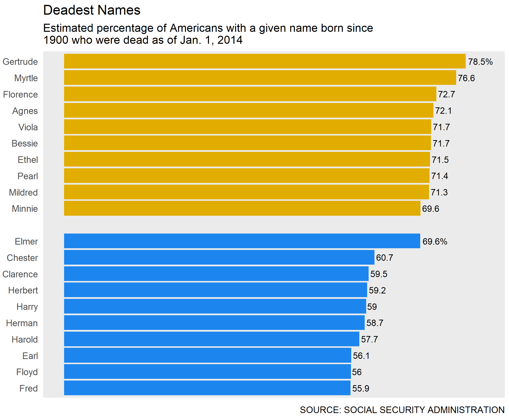

# Blog - Data Science

## R

### Beginner's Guide: Recreating "Deadest Names" Using `ggplot2`
(Tuesday, 2019-10-22)

#### Intro  
This is an R lab project from Data Science 1 of the master's program in biostats and data science at Weill Cornell, taught by [Dr. Elizabeth Sweeney](https://emsweene.github.io/index.html). This tutorial is created for beginner R users with basic knowledge of R Studio IDE, data types, and  visualization. Please refer to R Documentation if you're uncertain of any functions. Google search results, particularly StackOverflow, are also your friends.  

#### Goal  
In 1.5 hours, we'd like to reproduce one of the plots, [Deadest Names](https://fivethirtyeight.com/features/how-to-tell-someones-age-when-all-you-know-is-her-name/), published on [FiveThirtyEight](https://fivethirtyeight.com). You may find the original prompt [here](files/Lab_1_question.pdf).  

<div class="column-left">
\btwocol

Original plot  
```{r original 2, echo=FALSE}
library(knitr)
include_graphics("images/silver-feature-names-dead2.png")
```

</div>
\columnbreak
<div class="column-right">

R Duplicate using `ggplot2`  
```{r duplicate 2, echo=FALSE}
library(knitr)

```
  
\etwocol
</div>  


#### Step 1. Data prep  
First, we load a library, *mdsr*, using `library()`. Remember to install the package using `install.packages("mdsr")` if the package is not in your R library. You may need to do this installation only once. Do the same to load *tidyverse* (we'll use *dplyr* and *ggplot2* mapped in *tidyverse*). Note that in a code chunk, pond sign # leads a comment line (R will not execute).  
We will then assign a data table `BabynamesDist` from the function `make_babynames_dist()`. 
```{r, message=FALSE, results='hide'}
# load R package "mdsr"
library(mdsr)
library(tidyverse)
# Create our data table
BabynamesDist <- make_babynames_dist()
```

Once you load the data, take a look at what it is like. We'll use `glimpse()` from the package *dplyr* and `summary()` from base R. Pay attention to the data class of each column. How many rows and columns are there?   

```{r}
glimpse(BabynamesDist)
summary(BabynamesDist)
```

#### Step 2. Get top 10 names
For females and males respectively.

Now, we will create two subsets of `BabynamesDist` that contain top 10 names for females and males respectively. We'll use pipe operators to generate the two tables. A good practice is to use `-> names_fem_10` at the end of the pipe, but for now, we'll do it the traditional way.  

1. `filter(sex == "F")` - select only females;  
2. `group_by(name)` - grouped by name (consider this as a temporary holder for many name groups);  
3. `summarise(..)` - based on each name group, create 2 columns that summarise each group data;  
4. `filter(N >= 100000)` - select only names with more than 100,000 observations;  
5. `arrange(desc(est_percent_dead))` - order the data by the column `est_percent_dead`, high to low;  
6. `head(10)` - select the first 10 names;  
7. `mutate(sex = "Female")` - create a new column indicating the sex.
```{r}
# For females
names_fem_10 <- BabynamesDist %>%
  filter(sex == "F") %>%
  group_by(name) %>%
  summarise(N = sum(n),
            est_percent_dead = 1 - sum(est_alive_today) / N) %>%
  filter(N >= 100000) %>%
  arrange(desc(est_percent_dead)) %>%
  head(10) %>%
  mutate(sex = "Female")
```

The top 10 female names, and their respective number of observations, and estimated percentage of death are as follows. They don't look exactly like that of the original post, but are pretty similar, so we'll just comply!
```{r}
names_fem_10
```

Similarly, we'll create a table for males.
```{r}
# For males
names_male_10 <- BabynamesDist %>%
  filter(sex == "M") %>%
  group_by(name) %>%
  summarise(N = sum(n),
            est_percent_dead = 1 - sum(est_alive_today) / N) %>%
  filter(N >= 100000) %>%
  arrange(desc(est_percent_dead)) %>%
  head(10) %>%
  mutate(sex = "Male")
```

Now have a look at these male names:
```{r}
names_male_10
```

#### Step 3. Merge tables

Now we'll merge the female and male table, and modify the data a little bit to better cater to reproduce the plot. We'll use `rbind()` function to combine the two tables by row; i.e., the new table contains the female table as the first 10 rows, and the male table as the next 10 rows.  

Sometimes `ggplot2` orders our data in a strange way; to avoid this, we will *lock* the order of our data using `factor()`.

```{r}
# Merge two tables
names_top_20 <- rbind(names_fem_10, names_male_10)
## Lock the factor order of names
names_top_20$name <- factor(names_top_20$name, levels = rev(names_top_20$name))
```

Since the original plot is showing the percentage, not the probability, we will multiply our percentage column by $100$ and then round to 1 decimal point. Also, only the first name in each gender group has a percentage sign "%" attached to the number, and we will create a `label` column accordingly, too.

```{r}
# Create a percent label
names_top_20 <- names_top_20 %>%
  mutate(label = round(est_percent_dead * 100, 1))
## Add "%" sign
for (i in c(1,11)){
  names_top_20[i,"label"] <- paste(names_top_20[i,"label"], "%", sep = "")
}
```

Now have a look at the final data table, and we're ready to go! Note that interestingly, the percentage of the least deadest name of females is slightly higher than the percentage of the most deadest name of males. As a result, we have a natural ordered list of names by females and then by males.

```{r}
names_top_20
```

#### Step 4. The fun part!

Although I put comments in the code chunk, I'd like to illustrate a little bit further on a few "tricks" to make our ggplot as close to the original plot as possible.  

1. `geom_text()`: we use this function to add labels to the end of each colored bar. We set `aes()` to apply `label` column from our data table as our labels. `vjust()` and `hjust` adjust the positions of the labels vertically and horizontally, respectively. Finally, `size` sets the font size of our labels. You may need to adjust these values to tailor to the desired effects.
2. `scale_y_continuous(limits = c(0, 0.82))`: here we expand the range of y-axis (which is x-axis after flipping the coordinates) because the default range does not have enough space for our top label ("%" will be omitted). We use `y_continuous` because `est_percent_dead` is a continuous variable. Here you may also adjust the maximum value of the range (now it's 0.82) to tailor your needs.
3. `scale_x_discrete(limits = ...)`: the original post has an empty bar between female and male names; here we use the `scale_x_discrete` function to do the trick. Note that an empty space, " ", is inserted between two name groups. We use `discrete` instead of `continuous` because `name` is a discrete variable.
4. In `theme`, we use `aspect.ratio` to make our plot narrower.
5. In `labs`, we use `caption` to add small notations to the lower right corner of the plot.
6. `coord_flip`: after everything we've done, we finalize the plot using this function to *flip* the x-axis and y-axis.

```{r}
(ggplot(data = names_top_20, ## use the data we just created for plotting
       aes(x = name, 
           y = est_percent_dead,
           fill = sex)) + ## color the plot by sex
  geom_col() + ## we're making a bar plot
  geom_text(aes(label = label), ## Add labels to each bar using our label column
            vjust = 0.5, ## Adjust the position of labels so they are at the end of each bar
            hjust = -0.1,
            size = 3) +
  scale_fill_manual(values = c('#e1ad01','#1C86EE')) + ## fill the bars using matching colors
  scale_y_continuous(limits = c(0, 0.82)) + ## expand the background panel vertically
  scale_x_discrete(limits = c(levels(names_top_20$name)[1:10],
                              " ", ## create the empty line
                              levels(names_top_20$name)[11:20])) +
  theme(aspect.ratio = 0.75, ## set the height:width ratio as close as to the original plot
        legend.position = "none", ## remove any element that's not on the original plot
        panel.grid = element_blank(),
        axis.text.x = element_blank(),
        axis.ticks.x = element_blank(),
        axis.ticks.y = element_blank()) +
  labs(title = "Deadest Names",
       subtitle = "Estimated percentage of Americans with a given name born since\n1900 who were dead as of Jan. 1, 2014", ## label the plot with two lines
       caption = "SOURCE: SOCIAL SECURITY ADMINISTRATION") + ## label at the caption position
  xlab(NULL) +
  ylab(NULL) +
  coord_flip() -> p) ## flip coordinates, and assign the plot to p
```

Voila!

*******************
# Blog - English Learning

### 美国人都会的2000词

* $Title$: 2000 Words that Every American Knows  
[Course archive](http://www.cctalk.com/m/program/1501133815976337)  
* $Year$: 2017 - 2018  
* $Length$: 33 lectures  
* $Duration$: 70 min/ecture

### 美音开口练

* $Title$: American Accent Training  
[Course archive](https://www.cctalk.com/m/program/1501132424921353)  
* $Year$: 2016 - 2018  
* $Length$: 24 lectures  
* $Duration$: 55 min/ecture

### TOEFL口语话题王

* $Title$: TOEFL Speaking and Logical Thinking  
[Course archive](https://www.cctalk.com/m/program/1501134195399768)  
* $Year$: 2018  
* $Series$: 3  
* $Length$: 35 lectures  
* $Duration$: 55 min/lecture  

### 常用短语句型听力初级

* $Title$: Common Words and Phrases, Listening Practices - Level 1  
[Course archive](http://www.cctalk.com/course/160161700808/)    
* $Time$: 2016-01-17 to 2016-11-13  
* $Length$: 40 lectures  
* $Duration$: 55 min/lecture
