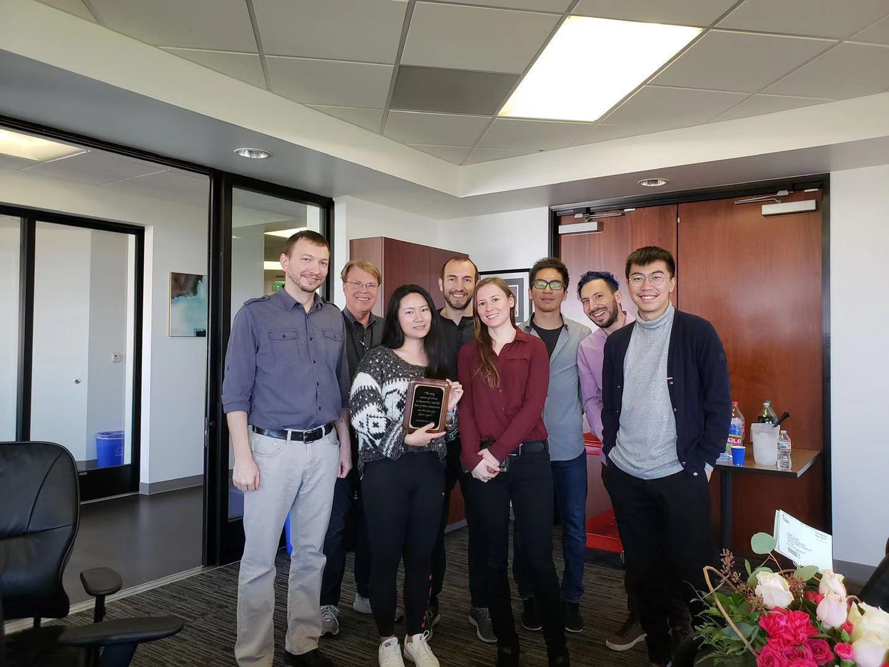

```{r, out.width = '30%', fig.align="left", echo = FALSE}
library(knitr)

```

Hello and welcome! My name is Paris Zhang. I am a data scientist and part-time master student in the Biostatistics and Data Science program at [Weill Cornell Medicine](https://weill.cornell.edu). Before coming to Weill Cornell, I spent ~3 years as a research data scientist doing bio-medical data analysis at [Scripps Research Translational Institute](https://www.scripps.edu › science-and-medicine › translational-institute) under [Dr. Nathan E. Wineinger](https://www.scripps.edu/science-and-medicine/translational-institute/about/people/nathan-wineinger/). I received my bachelor's degree in mathematics and economics from [UC, San Diego](https://ucsd.edu).

My primary tools for data science are **R** (including `ggplot2` and RMarkdown), **SQL** (SQL Server and Postgre-SQL), and **Python** (including Jupyter and `pandas`).

My resume and publications can be found [here](files/201910_Resume_ParisZhang-2p.pdf). One of my past projects, a mobile app [MyGeneRank](https://mygenerank.scripps.edu/), can auto-calculate your genetic risk. Come have a look!